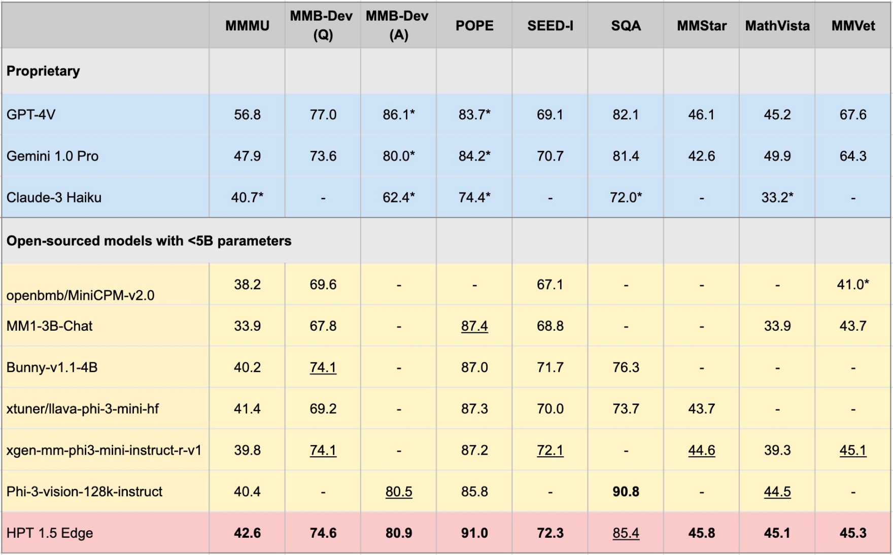

# HPT - Open Multimodal Large Language Models
Hyper-Pretrained Transformers (HPT) is a novel multimodal LLM framework from HyperGAI, and has been trained for vision-language models that are capable of understanding both textual and visual inputs. HPT has achieved highly competitive results with state-of-the-art models on a variety of multimodal LLM benchmarks. This repository contains the open-source implementation of inference code to reproduce the evaluation results of HPT on different benchmarks. 

## Release
- [6/06] :fire: Releasing **HPT 1.5 Edge**, our latest open-source model tailored to edge devices. Despite its size (<5B), Edge demonstrates impressive capabilities while being extremely efficient. HPT 1.5 Edge is publicly available on [[HuggingFace Repository](https://huggingface.co/HyperGAI/HPT1_5-Edge)]. Please read our [[technical blog post](https://hypergai.com/blog/hpt-1-5-edge-towards-multimodal-llms-for-edge-devices)] for more details.
- [5/03] **HPT 1.5 Air**, our best open-sourced 8B Multimodal LLM with [Llama 3](https://huggingface.co/blog/llama3). Built with Meta Llama 3, Our hyper capable HPT 1.5 Air packs a punch on real world understanding and complex reasoning. HPT Air 1.5 achieves the best results among <10B models across a wide range of challenging benchmarks (MMMU, POPE, SEED-I, and more). HPT 1.5 Air is publicly available on [[HuggingFace Repository](https://huggingface.co/HyperGAI/HPT1_5-Air-Llama-3-8B-Instruct-multimodal)]. Please read our [[technical blog post](https://hypergai.com/blog/hpt-1-5-air-best-open-sourced-8b-multimodal-llm-with-llama-3)] for more details.
- [3/16] **HPT 1.0 Air** is out, our most efficient model as a cost-effective solution that is capable of solving a wide range of vision-and-language tasks. HPT 1.0 Air is publicly available and achieves state-of-the-art results among all the open-source multimodal LLM models of similar or smaller sizes on the challenging MMMU benchmark. Please read our [[technical blog post](https://www.hypergai.com/blog/introducing-hpt-a-family-of-leading-multimodal-llms)] and [[HuggingFace Repository](https://huggingface.co/HyperGAI/HPT)] for more details.


We release HPT 1.5 Edge as our latest open-sources model tailored to edge devices. Despite its size (<5B), Edge demonstrates impressive capabilities while being extremely efficient. We release HPT 1.5 Edge publicly at Huggingface and Github under the Apache 2.0 license.


## Table of Contents
- [Overview of Model Achitecture](#overview-of-model-achitecture)
- [Quick Start](#quick-start)
  - [Installation](#installation)
  - [Prepare the Model](#prepare-the-model)
  - [Demo](#demo)
- [Evaluations](#evaluations)
- [Benchmarks](#benchmarks)
- [Pretrained Models Used](#pretrained-models-used)
- [Disclaimer and Responsible Use](#disclaimer-and-responsible-use)
- [Contact Us](contact-us)
- [License](#license)
- [Acknowledgements](#acknowledgements)


## Overview of Model Achitecture

<div align="center">
  
</div>
<br />

## Quick Start 

### Installation

```
pip install -r requirements.txt
pip install -e .
```

### Prepare the Model

You can download the model weights from HF into your [Local Path] and set the `global_model_path` as your [Local Path] in the model [config file](./vlmeval/config.py#L24):
```
git lfs install
git clone https://huggingface.co/HyperGAI/HPT1_5-Edge [Local Path]
```

You can also set other strategies in the [config file](./vlmeval/config.py#L24) that are different from our default settings.

### Demo

After setting up the config file, launch the model demo for a quick trial:

```
python demo/demo.py --image_path [Image]  --text [Text]  --model [Config]
```

Example:

```
python demo/demo.py --image_path demo/einstein.jpg  --text 'What is unusual about this image?'  --model hpt-edge-1-5
```

## Evaluations

Launch the model for evaluation:

```
torchrun --nproc-per-node=8 run.py --data [Dataset] --model [Config]
```

Example for HPT 1.5 Edge:

```
torchrun --nproc-per-node=8 run.py --data MMMU_DEV_VAL --model hpt-edge-1-5
```

## Benchmarks

**For HPT 1.5 Edge**

<div align="center">
  
</div>
<br />

- The majority of the results presented are taken from the models‘ original reports while the others are from Phi-3-vision evaluations, which we mark with an asterisk (*).
- The benchmark result of HPT1.5 Air and HPT1.0 is in assets directory.


## Pretrained Models Used

**HPT 1.5 Edge**

- Pretrained LLM: [Phi-3-mini-4k-instruct](https://huggingface.co/microsoft/Phi-3-mini-4k-instruct)

- Pretrained Visual Encoder: [siglip-so400m-patch14-384](https://huggingface.co/google/siglip-so400m-patch14-384)

**HPT 1.5 Air**

- Pretrained LLM: [Llama3-8B-Instruct](https://huggingface.co/meta-llama/Meta-Llama-3-8B-Instruct)

- Pretrained Visual Encoder: [siglip-so400m-patch14-384](https://huggingface.co/google/siglip-so400m-patch14-384)

**HPT 1.0 Air**

- Pretrained LLM: [Yi-6B-Chat](https://huggingface.co/01-ai/Yi-6B)

- Pretrained Visual Encoder: [clip-vit-large-patch14-336 ](https://huggingface.co/openai/clip-vit-large-patch14-336)

## Disclaimer and Responsible Use

Note that the HPT Air is a quick open release of our models to facilitate the open, responsible AI research and community development. It does not have any moderation mechanism and provides no guarantees on their results. We hope to engage with the community to make the model finely respect guardrails to allow practical adoptions in real-world applications requiring moderated outputs. 

## Contact Us

- Contact: HPT@hypergai.com 
- Follow us on [Twitter](https://twitter.com/hypergai).
- Follow us on [Linkedin](https://www.linkedin.com/company/hypergai/).
- Visit our [website](https://www.hypergai.com/) to learn more about us.


## License

This project is released under the [Apache 2.0 license](LICENSE). Parts of this project contain code and models from other sources, which are subject to their respective licenses and you need to apply their respective license if you want to use for commercial purposes.

## Acknowledgements

The evaluation code for running this demo was extended based on the [VLMEvalKit project](https://github.com/open-compass/VLMEvalKit). 
We also thank [OpenAI](https://openai.com) for open-sourcing their visual encoder models, [01.AI](https://www.01.ai), [Meta](https://www.meta.com/) and [Microsoft](https://www.microsoft.com/) for open-sourcing their large language models. 
